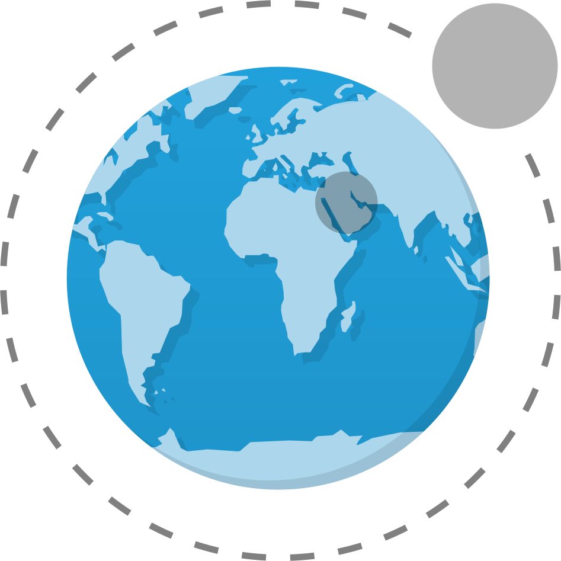

<h1 align="center">
  
  <br />
  Lua WPP | <a href="https://github.com/natanael-b/lua-wpp/archive/refs/heads/framework.zip">Baixar</a>
</h1>

<p align="center"><i>"Um jeito legal de criar Web Apps e páginas estáticas"</i></p>

<p align="center">
  <a href="https://github.com/natanael-b/lua-wpp/fork">
    
  </a>
  
  
  
</p>

Um pequeno mas poderoso Framework Lua para criar Web Apps e páginas estáticas, usando uma sintaxe muito mais limpa `Lua WPP` vai te fazer esquecer o HTML o clássico Olá mundo vai de:

```HTML
<!doctype html>
<html>
  <head>
    <meta charset="utf8" />
    <title>Demonstração</title>
    <meta content="width=device-width,initial-scale=1.0" name="viewport" />
  </head>
  <body>
    <h1>Olá mundo</h1>
  </body>
</html>
```

Para:

```lua
html {
  head {
    title 'Demonstração'
  };
  body {
    h1 'Olá mundo'
  }
}
```

Com custo zero de abstração já que a página final será um HTML puro

# Como se usa?

Com um interpretador Lua instalado e configurado no seu computador, adicione o `lua-wpp`:

1. Clique em <a href="https://github.com/natanael-b/lua-wpp/archive/refs/heads/framework.zip">baixar</a>
2. Extraia o conteúdo do `zip` para alguma pasta

Na pasta que você extraiu:

1. Crie um arquivo por exemplo `Project.lua` contendo:

```lua
Language = "pt_BR" -- Define o idioma padrão das páginas

Pages = {
  sources = "lua",
  output = "www",

  'index'
}

require "lua-wpp-framework"
```


